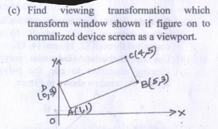
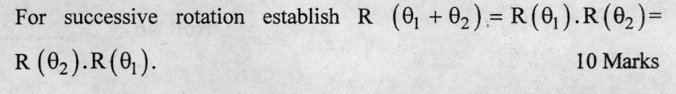
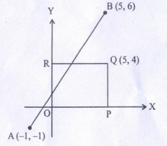
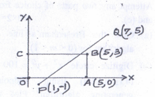
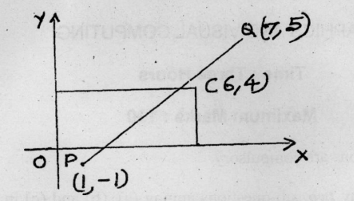
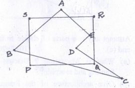
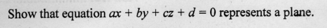

# Computer Graphics

## DDA

- give DDA for m < 1, L -> r
- 4,4 14,10
- 10,4 20,8
- 10,8 18,16

## Bresham Line

- 12,14 22,20
- 10,8 20,17
- 10,12 20,16

## Circle generation

3.2 Bresham

- Give Bresham. how we generate entire circle
- x^2 + y^2 = 144 in octant (45<=theta<=90)
- x^2 + y^2 = 100 in octant (45<=theta<=90)

3.3 Midpoint

- Give. Why is it named Midpoint Circle algorithm.
- WHy onle compute pixel in 1 octant.
- x^2 + y^2 = 100 in octant (45<=theta<=90)

## 2d Tranformations

4.1 Translation
4.2 Rotation

- 60 deg Anti-clock about origin, A(1,1) B(6,2) C(4,5)
- +60 deg about origin, A(0,0) B(2,0) C(2,2)
- 30 deg anti-clockwise, A(1,1) B(6,2) C(4,5)

4.3 Scaling

- P(4,5) after scaling about origin Sx = 1.0 and Sy = 0.50

4.4 Reflection

- A(3,4) B(5,7) C(8,6) about y = x-1
- A(3,5) B(5,8) C(7,10) about y = x
- P(2,5) Q(5,9) R(8,11) about y = x+1
- A(3,1) B(5,2) C(8,4) about y = -x + 2
- A(3,5) B(7,10) C(6,8) about y = x

4.5 Shearing

- Discuss. Find Transformation eq. about axes in 2-d.

Q. What is homogenous co-ordinate system?

- Write note viewing Transformation

## Successive Scaling and Rotation

- Discuss
- 

## Line Clipping

### Cohen Sutherland

- Discuss

### Liang Barsky

- What is clipping? Discuss Liang-Barsky.
- 
- 
- 

## Polygon Clipping

### Sutherland Hodgeman

- 

## Polygon Filling

### Boundary

- Give. How its different from flood fill.

### Flood

- Discuss

### Scan Line

- Discuss

