# mid


CLICK BUTTON

```java
import android.os.Bundle;
import android.view.View;
import android.widget.Button;
import android.widget.TextView;
import androidx.appcompat.app.AppCompatActivity;

public class MainActivity extends AppCompatActivity {
    private TextView textView;
    private int clickCount = 0;

    @Override
    protected void onCreate(Bundle savedInstanceState) {
        super.onCreate(savedInstanceState);
        setContentView(R.layout.activity_main);

        // Initialize views
        Button button = findViewById(R.id.button);
        textView = findViewById(R.id.textView);

        // Set click listener for the button
        button.setOnClickListener(new View.OnClickListener() {
            @Override
            public void onClick(View view) {
                // Increment click count and update text
                clickCount++;
                textView.setText("Button clicked " + clickCount + " times");
            }
        });
    }
}
```


activities example:

```java

import android.app.Activity;
import android.os.Bundle;
import androidx.appcompat.app.AppCompatActivity;

public class MainActivity extends AppCompatActivity {

  @Override
  protected void onCreate(Bundle savedInstanceState) {
    super.onCreate(savedInstanceState);
    setContentView(R.layout.activity_main);

    // UI element interaction logic can be placed here
  }
}
```

activity_main.xml
```xml
<?xml version="1.0" encoding="utf-8"?>
<androidx.constraintlayout.widget.ConstraintLayout
  xmlns:android="..."
  xmlns:app="..."
  xmlns:tools="..."
  android:layout_width="match_parent"
  android:layout_height="match_parent">

  <TextView
      android:id="@+id/text_view"
      android:layout_width="wrap_content"
      android:layout_height="wrap_content"
      android:text="Hello from Android!"
      app:layout_constraintBottom_toBottomOf="parent"
      app:layout_constraintLeft_toLeftOf="parent"
      app:layout_constraintRight_toRightOf="parent"
      app:layout_constraintTop_toTopOf="parent" />

</androidx.constraintlayout.widget.ConstraintLayout>
```

## Fragment (kinda like subactivity)

- represent reusable portions of a user interface (UI) within an activity
- provide a modular approach to building dynamic and complex UIs
- Modular UI Design
- Lifecycle Management
- Dynamic UI Changes

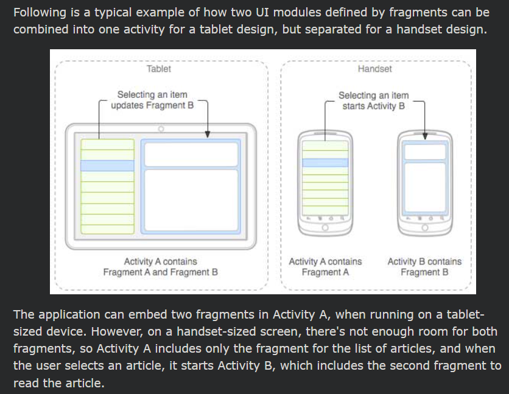

### Lifecycle

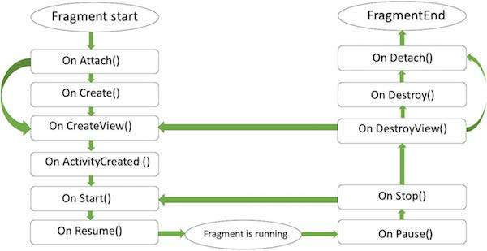
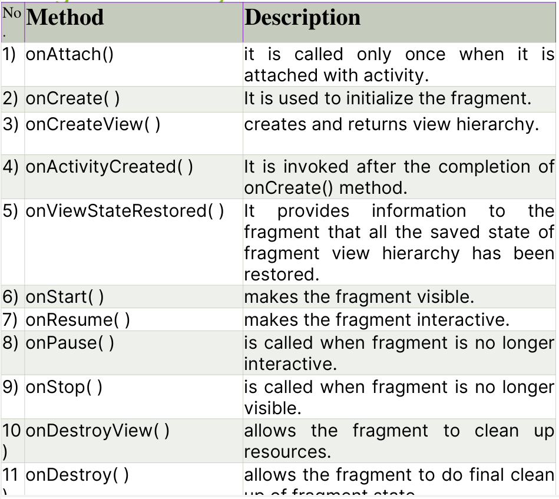

### WHY NEED FRAGMENT

- Parallel Execution
- Separation of Concerns - each frag. -> its own thing

## Intents

- Intents serve as messengers that coordinate communication and task execution between various components
- They act as a bridge, allowing activities, services, broadcast receivers, and even content providers to interact and exchange information.

### Intent Components:

1. Action: A string that describes the general action to be performed. Examples include android.intent.action.VIEW (to view content), android.intent.action.SEND (to send content), or custom actions defined within your app.

2. Data: Optional data associated with the action, often a URI representing the content to be viewed, edited, or shared.

### Types:

#### Explicit Intents:
Clearly specify the target component (activity, service, etc.) to interact with by mentioning its class name. This is useful when you know exactly which component needs to handle the action.


MainActivity.xml
```xml
<?xml version="1.0" encoding="utf-8"?>
<androidx.constraintlayout.widget.ConstraintLayout xmlns:android="http://schemas.android.com/apk/res/android"
  xmlns:app="http://schemas.android.com/apk/res-auto"
  xmlns:tools="http://schemas.android.com/tools"
  android:layout_width="match_parent"
  android:layout_height="match_parent">

  <Button
      android:id="@+id/launch_button"
      android:layout_width="wrap_content"
      android:layout_height="wrap_content"
      android:text="Launch Second Activity"
      app:layout_constraintBottom_toBottomOf="parent"
      app:layout_constraintLeft_toLeftOf="parent"
      app:layout_constraintRight_toRightOf="parent"
      app:layout_constraintTop_toTopOf="parent" />

</androidx.constraintlayout.widget.ConstraintLayout>
```

```java
import android.os.Bundle;
import android.view.View;
import android.widget.Button;
import android.content.Intent;
import androidx.appcompat.app.AppCompatActivity;

public class MainActivity extends AppCompatActivity {

    @Override
    protected void onCreate(Bundle savedInstanceState) {
        super.onCreate(savedInstanceState);
        setContentView(R.layout.activity_main);

        Button launchButton = findViewById(R.id.launch_button);

        launchButton.setOnClickListener(new View.OnClickListener() {
            @Override
            public void onClick(View v) {
                Intent intent = new Intent(MainActivity.this, SecondActivity.class);
                startActivity(intent);
            }
        });
    }
}
```

Explanation:

- We create a new Intent object, explicitly mentioning SecondActivity.class as the target component using the constructor Intent(Context context, Class<?> cls).
- The startActivity(intent) method launches the SecondActivity.


#### Implicit Intents:
Broadcast an action without specifying a particular receiver. The system then identifies potential receivers based on their capabilities and delivers the intent to the most suitable one. This is useful for generic actions like opening a web page or sharing content.

```xml
<?xml version="1.0" encoding="utf-8"?>
<androidx.constraintlayout.widget.ConstraintLayout xmlns:android="http://schemas.android.com/apk/res/android"
  xmlns:app="http://schemas.android.com/apk/res-auto"
  xmlns:tools="http://schemas.android.com/tools"
  android:layout_width="match_parent"
  android:layout_height="match_parent">

  <Button
      android:id="@+id/open_web_button"
      android:layout_width="wrap_content"
      android:layout_height="wrap_content"
      android:text="Open Website"
      app:layout_constraintBottom_toBottomOf="parent"
      app:layout_constraintLeft_toLeftOf="parent"
      app:layout_constraintRight_toRightOf="parent"
      app:layout_constraintTop_toTopOf="parent" />

</androidx.constraintlayout.widget.ConstraintLayout>
```


```java
import android.content.Intent;
import android.net.Uri;
import android.view.View;
import android.widget.Button;
import androidx.appcompat.app.AppCompatActivity;

public class MainActivity extends AppCompatActivity {

    @Override
    protected void onCreate(Bundle savedInstanceState) {
        super.onCreate(savedInstanceState);
        setContentView(R.layout.activity_main);

        // ... rest of your code for button click handling and opening a website
        Button openWebButton = findViewById(R.id.open_web_button);

        openWebButton.setOnClickListener(new View.OnClickListener() {
            @Override
            public void onClick(View v) {
                // Similar functionality to open a website as before
                Intent intent = new Intent(Intent.ACTION_VIEW, Uri.parse("https://www.example.com"));
                startActivity(intent);
            }
        });
    }
}
```

Explanation:

- We create a new Intent object with Intent.ACTION_VIEW as the action, indicating we want to view something.
- We provide the data URI (Uri.parse("https://www.example.com")) specifying the website URL to be opened.
- The system identifies apps that can handle web browsing (e.g., the default web browser) and launches the most suitable one to open the website.

## Similiarity

Imagine a house as your UI.

- Bricks (Views): Individual bricks represent the Views, the basic building blocks.
- Rooms (ViewGroups): Rooms act like ViewGroups, containing and organizing the bricks (Views) within them.
- House Blueprint (Layout): The house blueprint is similar to the layout file, defining the overall structure and room placement (ViewGroup positions).


## Layout

- A layout defines the structure for a user interface in your activity.
- All elements in the layout are built using a hierarchy of View and ViewGroup objects.
- define view
- Layout(View Group) is an invisible container that defines the layout structure for View and other Layout(View Group) objects.
- It provide a different layout structure, such as LinearLayout or ConstraintLayout.

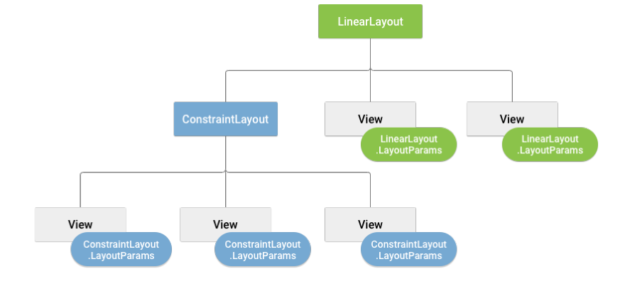

## View Group

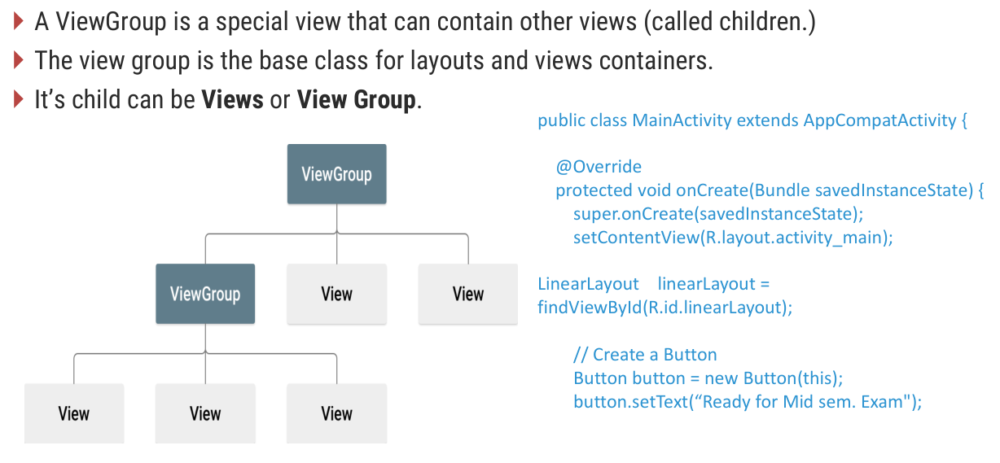

```java
import android.os.Bundle;
import android.widget.Button;
import android.widget.LinearLayout;
import androidx.appcompat.app.AppCompatActivity;

public class MainActivity extends AppCompatActivity {

    @Override
    protected void onCreate(Bundle savedInstanceState) {
        super.onCreate(savedInstanceState);
        setContentView(R.layout.activity_main);

        // Find the LinearLayout by its ID
        LinearLayout linearLayout = findViewById(R.id.linearLayout);

        // Create a Button with proper text formatting
        Button button = new Button(this);
        button.setText("Ready for Mid-sem. Exam"); // Use double-quotes for string literals

        // Add the Button to the LinearLayout
        linearLayout.addView(button);
    }
}
```

## Views

- the fundamental building blocks that make up the UI of your application.
- They are the interactive elements that users see and interact with on the screen

- Common View Types:
  - TextView: Displays text content.
  - 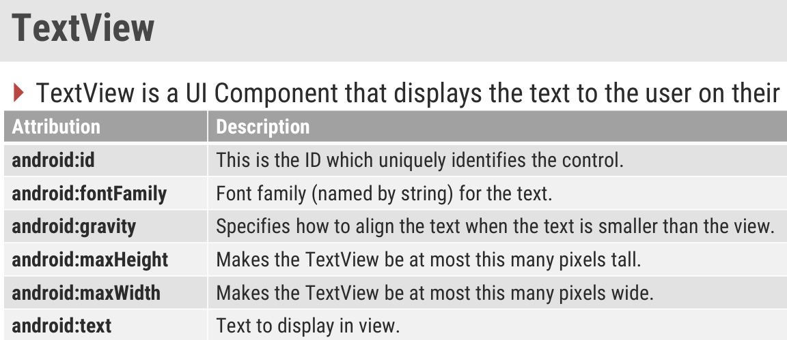
  - Button: Represents a clickable button for user interaction.
  - 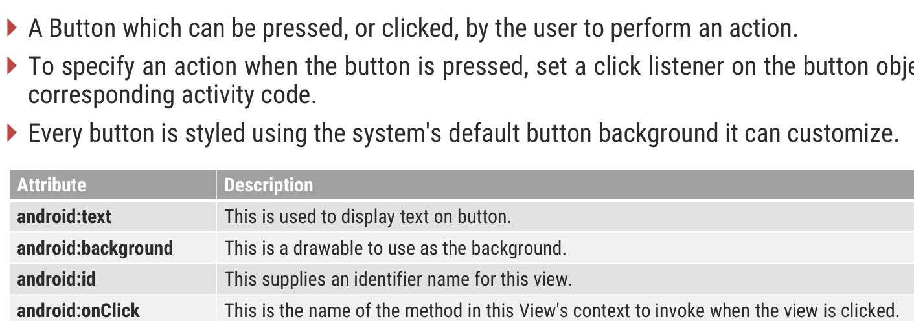
  - EditText: Allows users to enter text.
  - 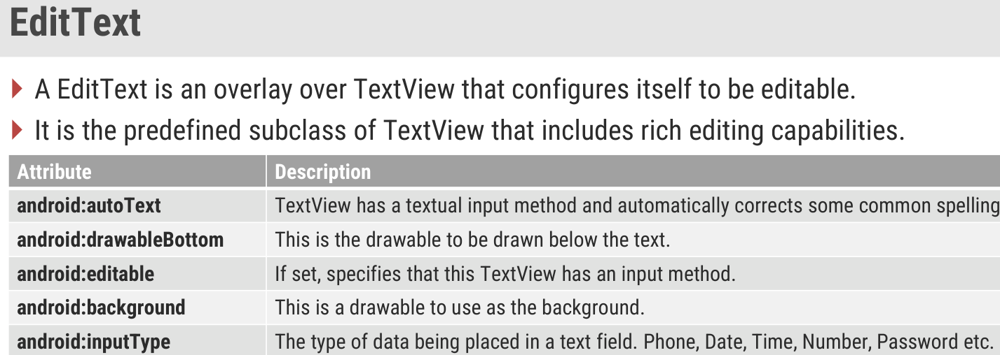
  - ImageView: Displays images.
  - LinearLayout: Arranges child views horizontally or vertically.
  - RelativeLayout: Positions child views relative to each other or the parent view.
  - ConstraintLayout: Provides flexible layout rules using constraints for precise positioning.

Example: same as activity

## Some Layout

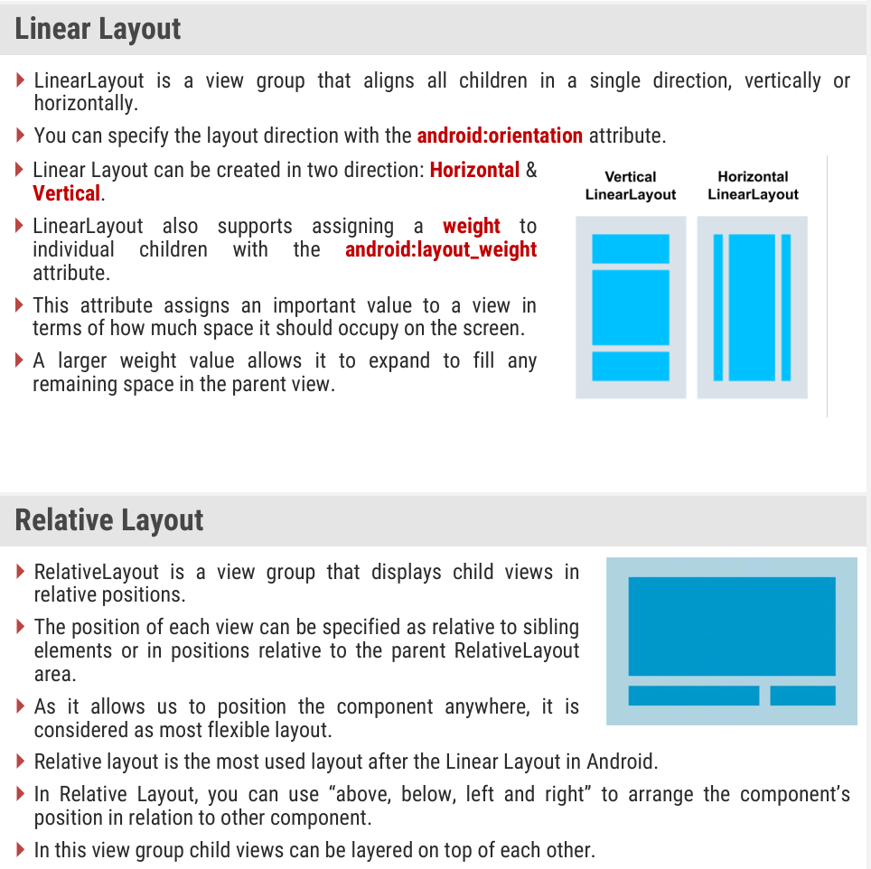

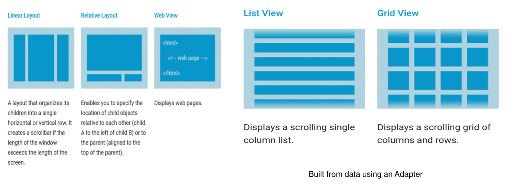


## Adaptor

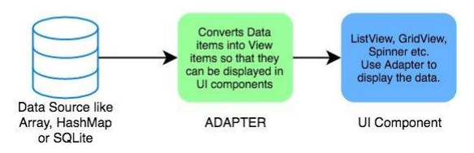

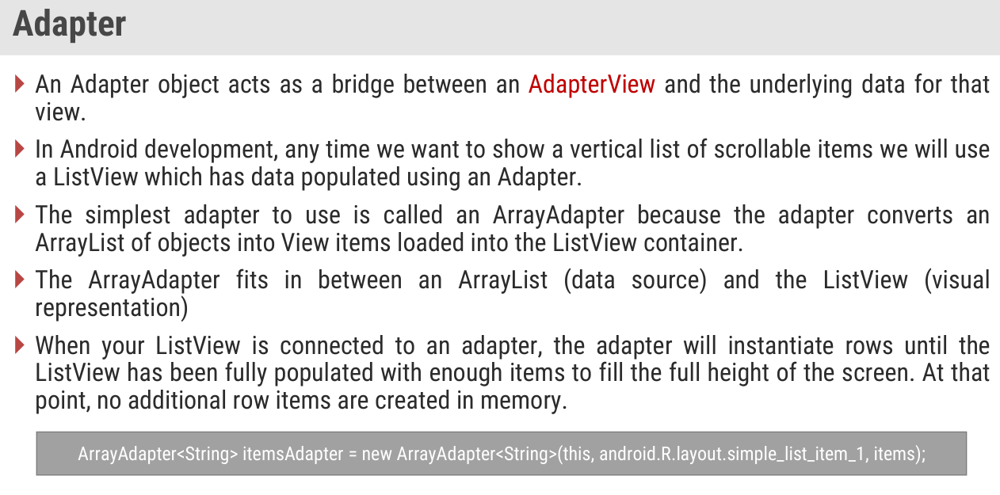

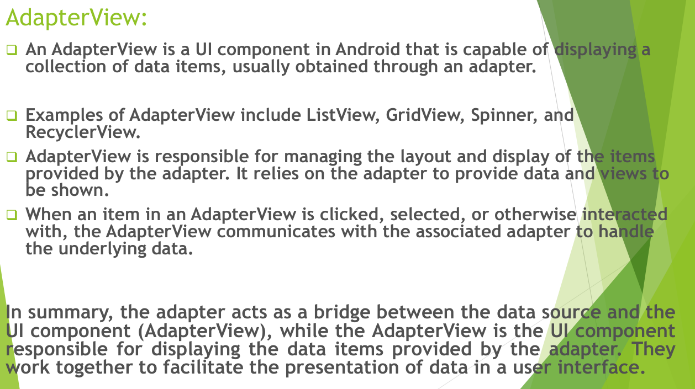

Example:

```java
// MainActivity.java
import android.os.Bundle;
import android.app.Activity;
import android.widget.ArrayAdapter;
import android.widget.ListView;

public class MainActivity extends Activity {
    ListView listView;
    String[] items = {"Item 1", "Item 2", "Item 3", "Item 4"};

    @Override
    protected void onCreate(Bundle savedInstanceState) {
        super.onCreate(savedInstanceState);
        setContentView(R.layout.activity_main);

        listView = (ListView) findViewById(R.id.list_view);
        ArrayAdapter<String> adapter = new ArrayAdapter<String>(this, android.R.layout.simple_list_item_1, items);
        listView.setAdapter(adapter);
    }
}
```

```xml
<!-- activity_main.xml -->
<ListView
    android:id="@+id/list_view"
    android:layout_width="match_parent"
    android:layout_height="match_parent" />
```


## Menu

Menus in Android development are a key user interface component that present user actions and other options within an app. Here's a detailed breakdown:

1. **Types of Menus**:
   - **Options Menu**: The primary collection of menu items, typically found in the app bar.
   - **Context Menu**: A floating menu that appears upon long-pressing an element.
   - **Popup Menu**: A vertical list of items anchored to the view that invoked it.

2. **Defining Menus**:
   - Menus are defined in XML within the `res/menu` directory.
   - The `<menu>` element is the root, containing `<item>` and `<group>` elements.

3. **Menu Items**:
   - Each `<item>` represents a single action with attributes like `id`, `icon`, `title`, and `showAsAction`.

4. **Inflating Menus**:
   - Menus are inflated in activities or fragments using `MenuInflater`.

5. **Handling Click Events**:
   - Override `onOptionsItemSelected()` for options menu.
   - Use `onCreateContextMenu()` for context menus.


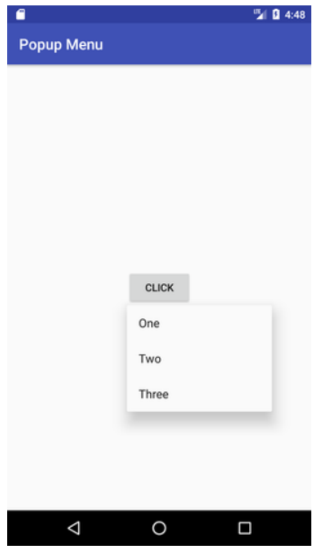


## Event Handling and Listeners

Event Handling:

- Events are actions performed by the user, such as touches or clicks.
- The Android framework manages events in a FIFO (First In, First Out) manner.
- Event handling involves responding to these actions with the desired task.

Event Listeners:

- These are interfaces in the View class that contain callback methods.
- They are triggered by user interaction, and the associated event handler performs the task.

Common Event Listeners:

- OnClickListener: Responds to click events.
- OnLongClickListener: Responds to long click events.
- OnTouchListener: Responds to touch events.


```java
// MainActivity.java
import android.os.Bundle;
import android.app.Activity;
import android.view.View;
import android.widget.Button;
import android.widget.Toast;

public class MainActivity extends Activity {
    Button button;

    @Override
    protected void onCreate(Bundle savedInstanceState) {
        super.onCreate(savedInstanceState);
        setContentView(R.layout.activity_main);

        button = (Button) findViewById(R.id.my_button);
        button.setOnClickListener(new View.OnClickListener() {
            @Override
            public void onClick(View v) {
                // This is the event handler for the click event
                Toast.makeText(getApplicationContext(), "Button Clicked", Toast.LENGTH_SHORT).show();
            }
        });
    }
}
```