# Unit 1

## Data Mining

- process of discovering patterns, correlations, and insights within large datasets to predict outcomes and make informed decisions.

1. **Large Datasets**: Data mining involves analyzing substantial amounts of data from various sources, such as databases, data warehouses, and other information repositories.

2. **Pattern Discovery**: The process seeks to identify recurring patterns and trends within the data. These patterns can be relationships between variables, clusters of data, or unusual data points.

3. **Correlation Identification**: Data mining helps in identifying correlations or dependencies among different variables in the dataset. This can be useful in understanding how changes in one variable might impact another.

4. **Insight Extraction**: The ultimate goal of data mining is to extract valuable insights from the data. These insights can be used to make predictions, inform decision-making, or understand complex phenomena.

5. **Techniques**: Various techniques are used in data mining, including machine learning, statistics, and database systems. Some common methods include classification, clustering, association rule learning, regression, and anomaly detection.

Example: A retail company might use data mining to analyze customer purchase history and identify patterns. They might discover that customers who buy product A are also likely to buy product B. This insight can be used to improve marketing strategies, such as bundling products A and B together for promotional sales.

### Data Minig Process

◼ Data integration and selection
◼ Data cleaning and pre-processing
◼ Modeling and searching for patterns
◼ Interpreting results
◼ Consolidating and deploying discovered
knowledge
◼ Loop

---

## Data Warehouse, Characteristics, OLAP, OLTP

- Questions

## Warehouse vs Hetero. DBMS and Operational DBMS

1. **Purpose**:
   - **Data Warehouse**: Designed for centralized data analysis and reporting, integrating data from multiple sources for business intelligence.
   - **Heterogeneous DBMS**: Focuses on providing a unified interface to access data from multiple, different databases without integration.

2. **Data Integration**:
   - **Data Warehouse**: Data is extracted, transformed, and loaded (ETL) from various sources into a single, consistent data format.
   - **Heterogeneous DBMS**: Data remains in its original source format, allowing for diverse data types and structures.

3. **Usage**:
   - **Data Warehouse**: Used for analytical reporting and complex queries to support decision-making.
   - **Heterogeneous DBMS**: Used for day-to-day operations, providing access to data across different database systems.

4. **Structure**:
   - **Data Warehouse**: Often structured in a way that optimizes data retrieval for analysis, such as using star or snowflake schemas.
   - **Heterogeneous DBMS**: Maintains the existing structure of each database, which can be relational, NoSQL, or others.

5. **Example**:
   - **Data Warehouse**: A company may use a data warehouse to store and analyze sales, customer, and market data to inform strategic decisions[^1^][^2^].
   - **Heterogeneous DBMS**: A university may use a heterogeneous DBMS to allow students and staff to access library, registration, and financial data through a single portal[^3^].

### VS OPERATIONAL, ITS JUST OLAP (WAREHOUSE) VS OLTP (OP. DBMS), Multi-dim. Data Model

---

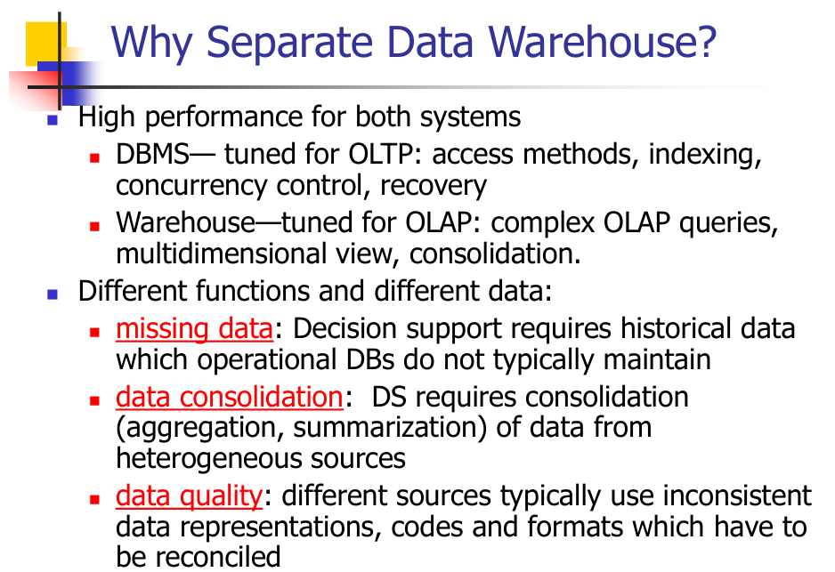

---

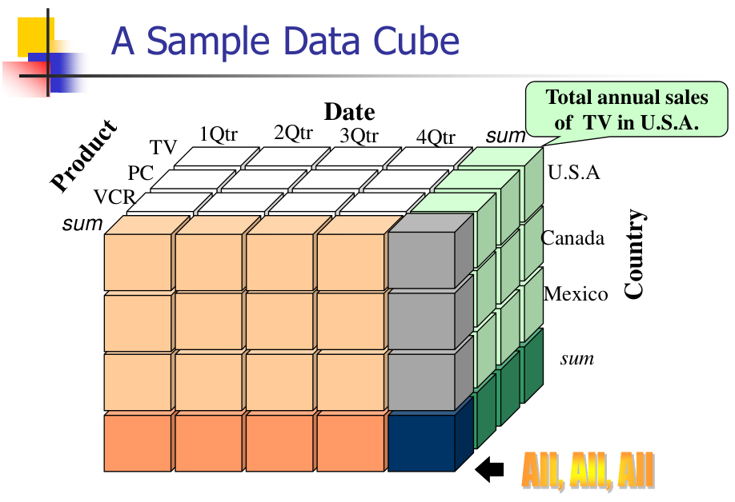

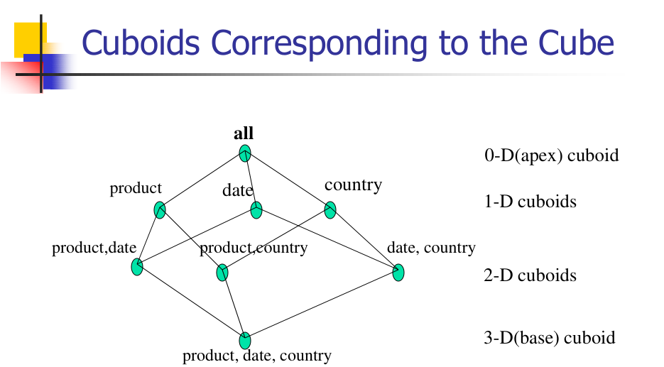

---

## Virtual Warehouse, Enterprise Warehouse

1. **Virtual Warehouse**:
   - A virtual warehouse is a method used to track all inventory and stock across multiple physical locations from a single, holistic view[^1^].
   - It is also known as multi-location inventory management and is often paired with enterprise resource planning (ERP) systems and inventory management software[^1^].
   - The virtual warehouse concept is particularly beneficial for businesses that need to fulfill customer orders quickly and with lower operating costs by identifying the fastest or cheapest fulfillment options for certain products[^1^].

2. **Enterprise Warehouse**:
   - An enterprise data warehouse (EDW) is a centralized repository that stores and manages all of an organization's data from sources across the entire business[^8^].
   - It is intended to be a single repository for all organizational data, as opposed to smaller data warehouses that may be specific to a business department or line of business[^8^].
   - The EDW enables data analytics and informs actionable insights by collecting and aggregating data from multiple sources, acting as a comprehensive data store to support broad access and analysis[^8^].

---

## OLAM

Online Analytical Mining (OLAM) is an extension of Online Analytical Processing (OLAP) that integrates data mining techniques into the OLAP framework. OLAM is designed to support advanced data analysis and knowledge discovery in large databases. Here are five key points about OLAM:

1. **Integration of Data Mining and OLAP**: OLAM combines the data mining techniques used for discovering patterns and relationships in large datasets with the multidimensional data modeling and querying capabilities of OLAP.

2. **Advanced Data Analysis**: OLAM supports advanced data analysis, including classification, clustering, association rule mining, and prediction. This allows businesses to gain deeper insights from their data and make more informed decisions.

3. **Interactive Analysis**: Like OLAP, OLAM supports interactive analysis of data. Users can drill down, roll up, and slice and dice data to gain different perspectives and uncover hidden patterns.

4. **Support for Large Datasets**: OLAM is designed to handle large datasets, making it suitable for use in data warehousing and business intelligence applications.

5. **Complexity**: OLAM is more complex than OLAP due to the integration of data mining techniques. This complexity can make OLAM systems more difficult to implement and manage than traditional OLAP systems.

In summary, OLAM extends the capabilities of OLAP by integrating data mining techniques, supporting advanced data analysis, and providing new ways to discover knowledge in large databases. However, this extension also introduces additional complexity that must be managed.

---

# Unit 2

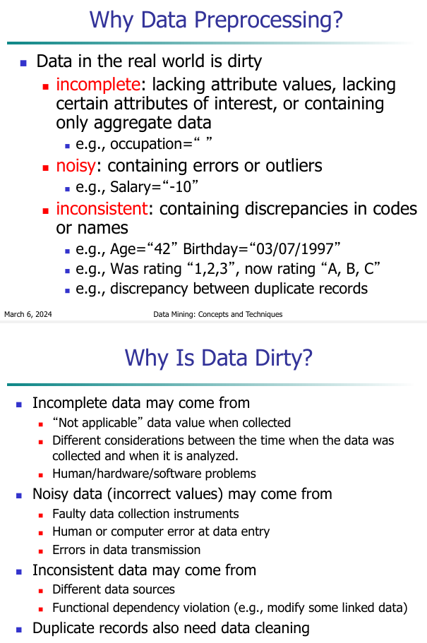

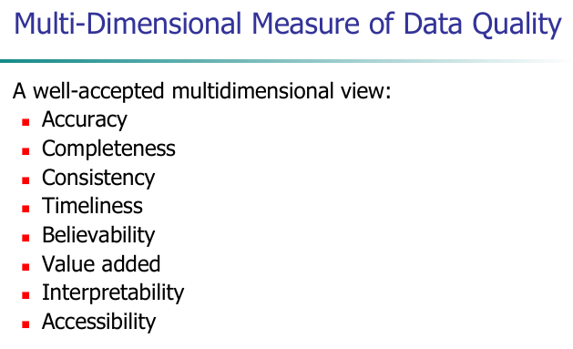

## Steps in Data Processing

- Data cleaning
- Data integration
- Data transformation
- Data reduction
- Data discretization

---

## Mean, Median, Mode ...

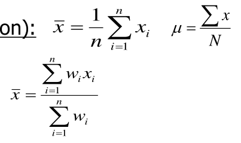

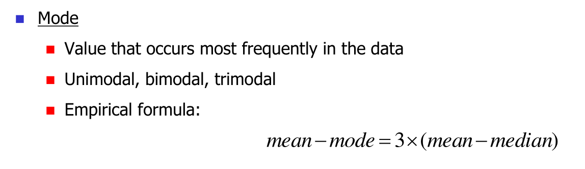

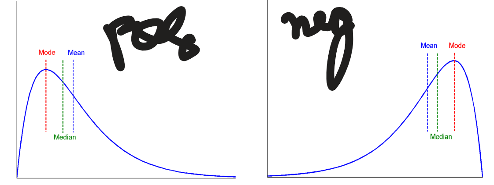

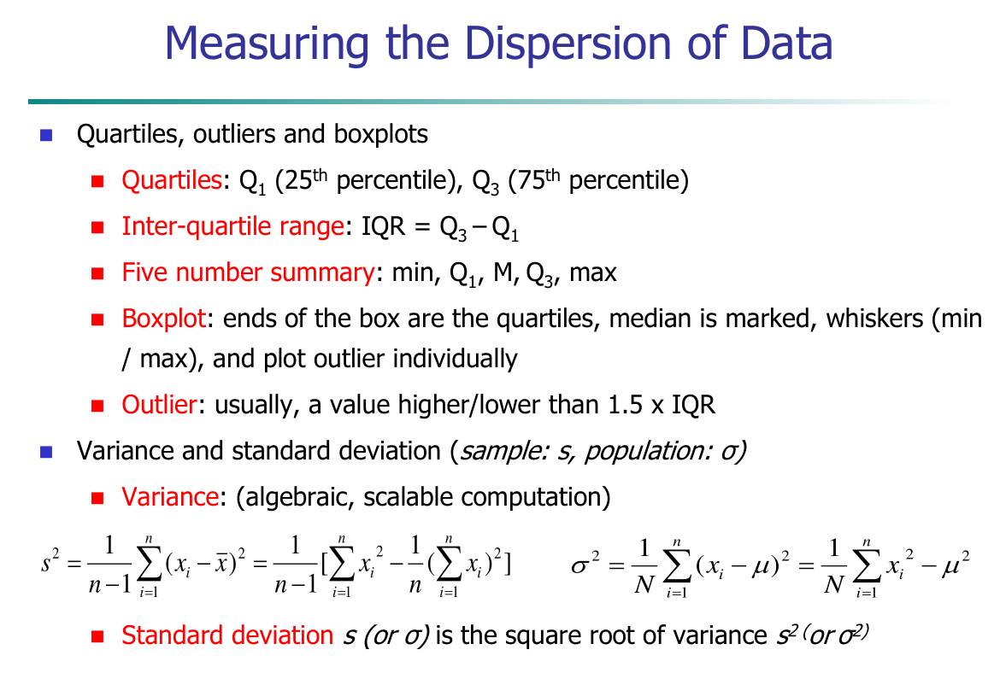

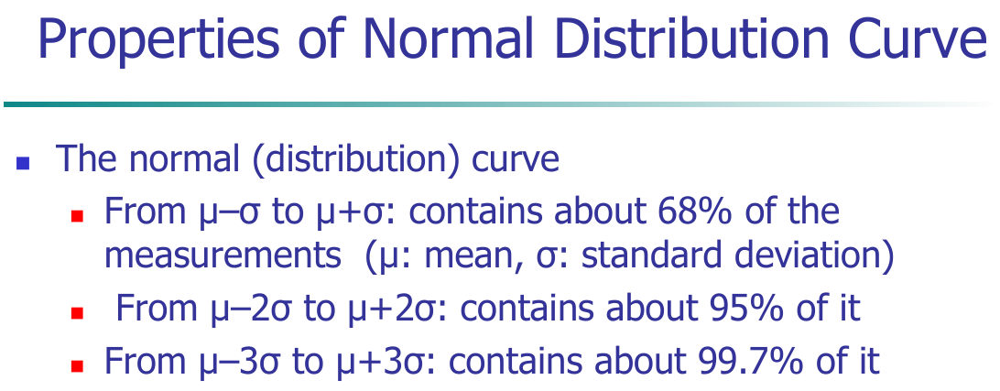

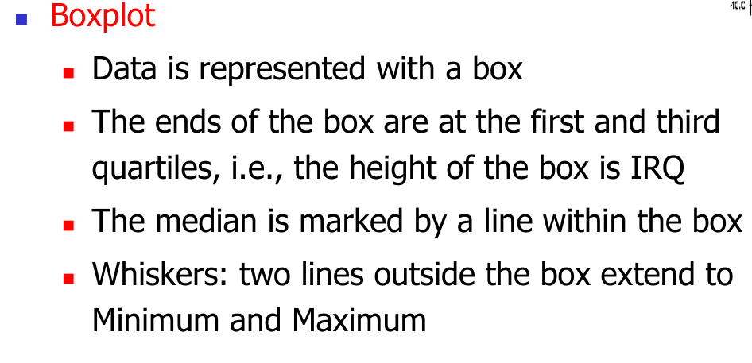

---

## Binning methods

1. **Equal-width (distance) partitioning:**
   - Divides the range of possible values into N intervals of equal size.
   - The width of intervals is: width = (max - min) / N

   - Easy to implement and understand.
   - Not robust to outliers as they can skew the distribution of data points across bins.
   - **Example:** Consider the data points [1, 2, 3, 4, 5, 6, 100]. If we choose N=3, the bins would be [1-34], [35-67], [68-100], which clearly shows that the outlier (100) affects the distribution.

2. **Equal-depth (frequency) partitioning:**
   - Divides the range of possible values into N intervals, each containing approximately the same number of samples.
   - The depth of intervals is: depth = total number of values / N
   - More robust to outliers as it ensures a more even distribution of data points.
   - Can result in intervals of varying widths.
   - **Example:** Using the same data points [1, 2, 3, 4, 5, 6, 100] and choosing N=3, the bins would be [1-3], [4-6], [100], ensuring each bin has the same number of data points (assuming the last bin can have fewer points).

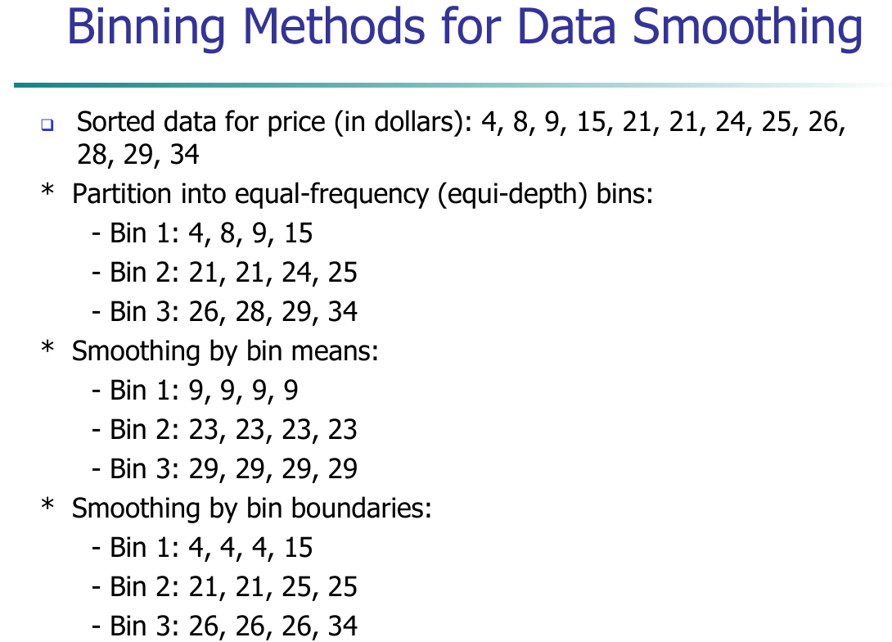

---

## Data Integration

1. **Definition:**
   - It refers to the process of harmonizing and consolidating data from multiple sources into a coherent format for analysis and decision-making.

2. **Significance:**
   - It becomes essential in commercial scenarios like mergers and scientific research, where data from various sources need to be combined.

3. **Challenges:**
   - The process addresses issues like data silos and inconsistencies that arise from data being stored in different formats and locations.

4. **Process:**
   - Data integration typically involves identifying data sources, extracting data, mapping data from different terminologies, validating data quality, transforming data into a common format, and loading it into a destination system for analysis.

5. **Techniques:**
   - Techniques like Extract, Transform, Load (ETL), data warehousing, and data virtualization are commonly used.

6. **Benefits:**
   - It enables efficient data management, analysis, and access to information, leading to informed decision-making and reporting.

7. **Example:**
   - A business may integrate customer data from its CRM system with transaction data from its sales database to gain comprehensive insights into customer behavior.

---

## Handle Redundancy in Data Integration

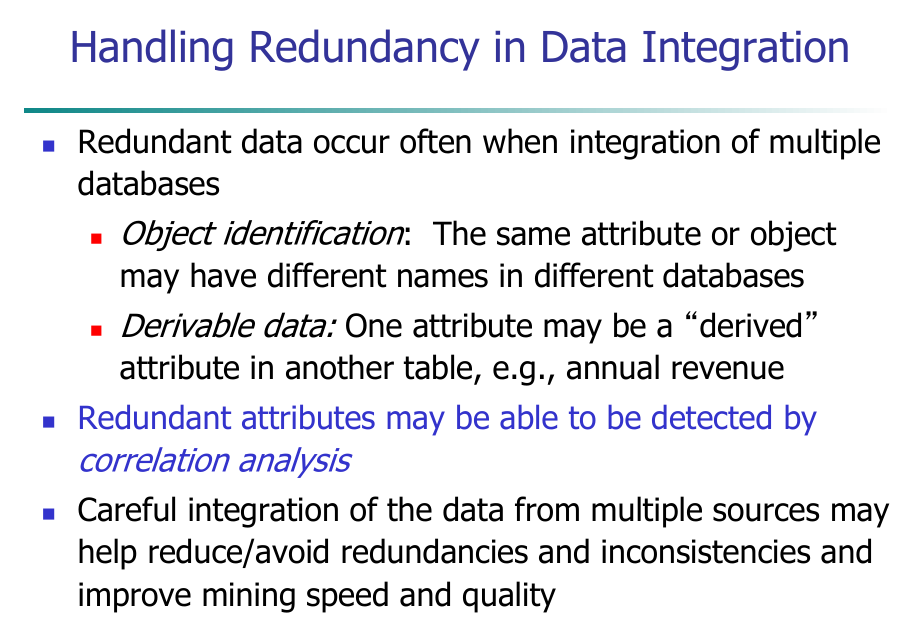

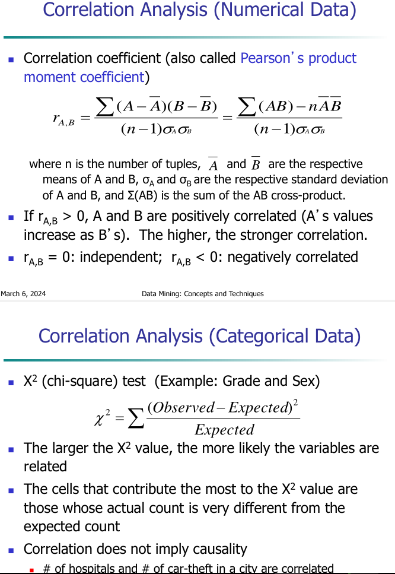

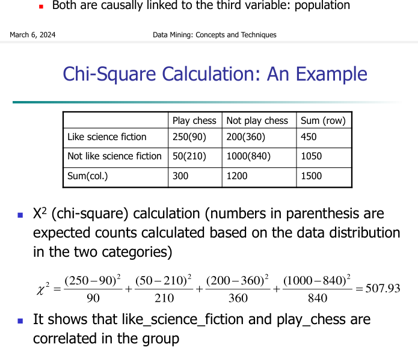

---
