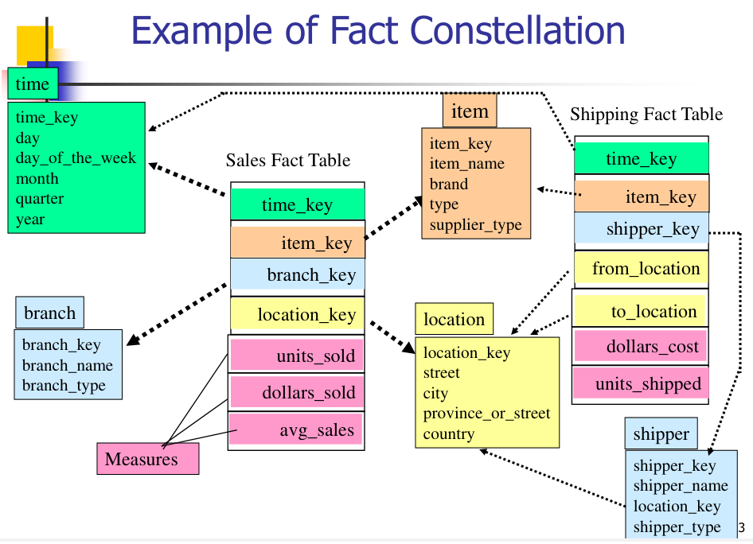

# Questions

## 1. What is Data Warehouse ? Define the various characteristics of data warehouse.

1. **Definition**: A data warehouse, often referred to as an Enterprise Data Warehouse (EDW), is a repository for integrated data from multiple disparate sources.

2. **Purpose**: It supports business intelligence activities including analytics, data mining, and reporting.

3. **Architecture**: Typically, it has a three-tier architecture:
   - **Bottom Tier**: The data warehouse server, which collects, cleanses, and transforms data through ETL (Extract, Transform, Load) or ELT (Extract, Load, Transform) processes.
   - **Middle Tier**: An OLAP (Online Analytical Processing) server for fast query speeds.
   - **Top Tier**: A front-end user interface for conducting ad-hoc data analysis.

Characteristics:

1. **Subject-Oriented**: A data warehouse is organized around specific subjects or areas of interest within an organization, such as sales, finance, or marketing. This allows data to be easily accessed and analyzed based on the specific needs of different departments.

2. **Integrated**: Data from various sources is cleaned, transformed, and integrated into the data warehouse. This ensures consistency and uniformity in data representation, making it easier for users to query and analyze the data.

3. **Time-Variant**: Data in a data warehouse is stored over a long period of time to support historical analysis and trend identification. This is in contrast to operational databases, which typically only store recent data.

4. **Non-Volatile**: Once data is stored in a data warehouse, it does not change. This means that the data warehouse is not updated in real-time like an operational database. Instead, data is loaded into the warehouse on a regular schedule (e.g., daily, weekly, monthly).

5. **Uses OLAP (Online Analytical Processing)**: Data warehouses often use OLAP systems to enable users to analyze data from multiple dimensions, calculate and analyze aggregations, and perform complex analytical operations.

Example: A multinational retail company might have a data warehouse that collects data from its various departments (like sales, inventory, and customer service) and stores it in a central location. This allows the company to perform detailed analysis on its operations, identify trends, and make data-driven decisions.

---

## 2. Differentiate between OLAP and OLTP.

OLAP (Online Analytical Processing) and OLTP (Online Transaction Processing) are two different types of database systems designed to handle specific types of workloads. Here's a comparison between the two:

1. **Purpose**:
   - OLTP is designed for managing real-time transactional data. It is used for inserting, updating, and deleting records in a database.
   - OLAP, on the other hand, is designed for data analysis and business intelligence. It is used for querying and aggregating data to identify trends and patterns.

2. **Workload**:
   - OLTP systems handle a large number of short transactions. The focus is on concurrency control and maintaining data integrity.
   - OLAP systems handle complex queries that often involve aggregating large amounts of data. The focus is on query optimization and performance.

3. **Data Schema**:
   - OLTP databases typically use a normalized schema to minimize data redundancy and maintain data integrity.
   - OLAP databases often use a denormalized schema, such as a star schema or snowflake schema, to optimize query performance.

4. **Data Freshness**:
   - OLTP databases contain the most recent data, as they are updated in real-time.
   - OLAP databases contain historical data, which is periodically loaded from OLTP databases or other sources.

5. **Operations**:
   - OLTP operations include INSERT, UPDATE, DELETE, and simple SELECT queries.
   - OLAP operations include complex SELECT queries with aggregations, groupings, and joins.

6. **Users**:
   - OLTP users are typically operational users who interact with the system on a daily basis to perform tasks.
   - OLAP users are typically analysts and decision-makers who use the system to gain insights and make strategic decisions.

no. of records accessed

tens        millions

no. of users

thousands       hundreds

DB size

100MB-GB        100GB-TB

Example: An e-commerce company would use an OLTP system to manage customer orders, inventory, and transactions. It would use an OLAP system to analyze sales trends, customer behavior, and other business metrics.

---

## Multi-dimensional Data Model and Schemas

Multi-dimensional Data Model

- The multi-dimensional data model is a data representation technique used in data warehousing and OLAP (Online Analytical Processing) systems to support complex data analysis and querying.
- It structures data into multiple dimensions and hierarchies, allowing users to analyze data from different perspectives and levels of detail.

## Schemas of Multi-dimensional Data Model

1. **Star Schema**:
   - **Definition**: A star schema is a type of data warehouse schema that consists of a single central fact table surrounded by dimension tables.
   - **Fact Table**: Contains the core data, typically transactional measurements, and foreign keys to dimension tables.
   - **Dimension Tables**: Contain descriptive attributes related to fact data. They are denormalized, meaning they may contain redundancy.
   - **Advantages**: Simplifies queries, improves performance, and is easy to understand.
   - **Example**: Consider a sales database with a fact table recording sales transactions. The dimension tables might include Date, Product, Customer, and Store.
   -
   - 

2. **Snowflake Schema**:
   - **Definition**: An extension of the star schema where dimension tables are normalized, breaking them down into related tables.
   - **Fact Table**: Remains central and is linked to dimension tables.
   - **Dimension Tables**: Further divided into related sub-dimension tables, forming a complex structure.
   - **Advantages**: Reduces data redundancy and improves data integrity.
   - **Example**: In the same sales database, the Product dimension table might be split into sub-dimension tables like Category, Subcategory, and Product Details.
   -
   -  

3. **Fact Constellation Schema**:
   - **Definition**: Also known as a galaxy schema, it consists of multiple fact tables that share common dimension tables.
   - **Fact Tables**: Each represents a different business process with its own metrics.
   - **Dimension Tables**: Shared among the fact tables, providing a consolidated view.
   - **Advantages**: Supports multiple business processes and complex queries.
   - **Example**: Extending the sales database, there could be separate fact tables for Sales and Returns, both linked to common dimensions like Date, Product, and Customer.
   -
   - 

These schemas are foundational for structuring data warehouses, each with its own use cases and benefits. Star schema is straightforward and fast for querying, snowflake schema is more normalized with less redundancy, and fact constellation schema supports complex business analytics with multiple fact tables.

---

In a data warehouse, measures are the quantitative or numerical values that are used for analysis and decision-making. Measures can be classified into different types based on their properties and how they can be aggregated. Here's a detailed explanation of the three types of measures:

1. **Distributive Measures**: Distributive measures are the simplest type of measures, as they can be computed by applying the same aggregation function to each partition of the data, and then combining the results to get the overall result. Distributive measures are highly scalable, as they can be computed in parallel on different partitions of the data. They are also very efficient, as they require minimal storage space and computation time.

Examples of distributive measures include:

  - **count()**: If you're counting the number of customers in different stores, you can count them store by store and sum the counts to get the total number of customers.
  - **sum()**: To calculate total sales, you can sum the sales for each day and then add these sums to get the total sales for the period.
  - **min()**: Finding the lowest price among different products can be done by identifying the lowest price in each category and then selecting the lowest of these values.
  - **max()**: To determine the highest score in a game, you can find the highest score in each level and then take the highest score among these.

Distributive measures are useful for performing simple aggregations and comparisons on large datasets.

2. **Algebraic Measures**: Algebraic measures are more complex than distributive measures, as they require applying an algebraic function with a fixed number of arguments, where each argument is obtained by applying a distributive aggregate function. Algebraic measures are still highly scalable and efficient, as they can be computed using a fixed amount of storage space, regardless of the size of the data.

Examples of algebraic measures include:

  - **avg()**: The average temperature in a city can be calculated by summing the temperatures recorded every hour (sum) and dividing by the number of recordings (count).
  - **min_N()**: To find the three smallest files on a computer, you can identify the smallest file in each folder and then select the smallest three among these.

Algebraic measures are useful for performing more complex aggregations and statistical analyses on large datasets.

1. **Holistic Measures**: Holistic measures are the most complex type of measures, as they cannot be computed using a fixed amount of storage space, regardless of the size of the data. Holistic measures require processing the entire dataset to compute the result, which can be computationally expensive and time-consuming.

Examples of holistic measures include:

  - **median()**: To find the median income, all incomes must be listed in order from lowest to highest to find the middle value.
  - **mode()**: Determining the most common name in a database requires analyzing all names to see which one appears most frequently.
  - **rank()**: Ranking students by their test scores requires the entire list of scores to assign each student a rank based on their score relative to others.

Holistic measures are useful for performing complex analyses that require processing the entire dataset, such as identifying outliers, clustering data, and performing predictive modeling. However, due to their computational complexity, they should be used judiciously and with appropriate optimization techniques.

---

## Concept Heirarchy

1. **Schema Hierarchy**:
   - **Definition**: A schema hierarchy organizes attributes or elements in a database schema into a tree-like structure, where each level represents a more general concept than the one below it.
   - **Detail**: It is particularly useful in data warehousing, where data from multiple sources needs to be integrated and organized logically.
   - **Example 1**: A company's organizational structure could be represented as Employee < Department < Division < Corporation.
   - **Example 2**: A location hierarchy might be structured as City < State < Country.

2. **Set-Grouping Hierarchy**:
   - **Definition**: This hierarchy is based on set theory, where each set is defined by its membership in other sets, allowing for the grouping of data into subsets that share common characteristics.
   - **Detail**: It can be used for tasks like data cleaning, pre-processing, and integration, helping to identify and remove outliers or inconsistencies.
   - **Example 1**: A hierarchy of products could be organized into sets such as {Electronics} = {TVs, Radios, Computers}.
   - **Example 2**: Age groups might be defined as {Adults} = {People aged 18-65}, with further subsets like {Middle-aged} = {People aged 36-55}.

3. **Operation-Derived Hierarchy**:
   - **Definition**: This hierarchy is created by applying a series of operations or transformations to the data, often used for numerical attributes.
   - **Detail**: Operations such as encoding, decoding, or information extraction are applied to derive a hierarchy that represents different levels of abstraction.
   - **Example 1**: Income levels could be categorized into ranges like Low < Medium < High based on specific numerical thresholds.
   - **Example 2**: Time periods might be organized as Days < Weeks < Months < Quarters < Years based on date calculations.

4. **Rule-Based Hierarchy**:
   - **Definition**: A rule-based hierarchy uses a set of rules or conditions to define the relationships between different levels of data.
   - **Detail**: This type is often used in classification, decision-making, and data exploration tasks in data mining.
   - **Example 1**: Customer loyalty tiers could be defined by rules such as "If annual spending is over $5000, then classify as Gold member."
   - **Example 2**: A traffic system might use rules like "If speed is over 100 km/h, then classify as Over-speeding."

---

## OLAP Operations

1. **Roll-up (Drill-up)**: This operation aggregates data along a dimension hierarchy, increasing the level of summarization.
2.
3. **Drill-down (Roll-down)**: This is the opposite of roll-up, where the data is broken down to finer levels of detail.

4. **Slice**: This operation performs a selection on one dimension of the given cube, resulting in a sub-cube.

5. **Dice**: The dice operation defines a sub-cube by performing a selection on two or more dimensions.

6. **Pivot (Rotate)**: This operation rotates the data axes in view to provide an alternative presentation of data.

7. **Drill-across**: This operation involves using information from different cubes to perform an analysis.

8. **Drill-through**: This operation accesses the detailed data that backs up the summarized data in the cube.

### Let's consider a data warehouse that stores sales data for a retail chain. The data is organized into a multidimensional cube with dimensions for time (years, quarters, months), products (categories, subcategories), and location (regions, countries, cities).

Here's how we can apply the OLAP operations to this example:

1. **Roll-up (Drill-up)**: We start with sales data at the city level for each product subcategory on a monthly basis. We can roll-up to the country level and summarize the data by product category on a quarterly basis.

   - *Example*: Aggregating sales data from all cities in Australia to get the total quarterly sales for each product category.

2. **Drill-down (Roll-down)**: Conversely, we can drill down from the country level to the city level and from product categories to subcategories to get monthly sales data.

   - *Example*: Breaking down the quarterly sales data for electronics in Australia to see the monthly sales data for smartphones in Sydney.

3. **Slice**: We can slice the cube to look at the sales data for a particular year and product category across all regions.

   - *Example*: Analyzing the 2023 sales data for the electronics category across all regions.

4. **Dice**: We can dice the cube to focus on a specific region and time period, looking at sales data for multiple product categories.

   - *Example*: Examining the sales data for electronics and home appliances in the Asia-Pacific region during Q2 of 2023.

5. **Pivot (Rotate)**: We can pivot the cube to change the orientation of the data, such as swapping the axes for products and time.

   - *Example*: Rotating the cube to view the monthly sales data with time on the vertical axis and product subcategories on the horizontal axis.

6. **Drill-across**: We can drill across by comparing the sales data cube with another cube, such as the budget allocation cube for marketing.

   - *Example*: Comparing the actual sales data for Q1 of 2023 with the budgeted marketing expenses for the same period.

7. **Drill-through**: Finally, we can drill through the summarized data to access the underlying transaction-level data.

   - *Example*: Accessing the individual sales transactions that contributed to the total sales figure for smartphones in Sydney for January 2023.

---

## Data Warehouse Architecture

1. **Bottom Tier (Data Warehouse Server)**:
   - This is the foundation layer where the data warehouse resides.
   - It's typically implemented as a relational database management system (RDBMS).
   - The bottom tier stores the cleaned and processed data from various source systems.
   - It may include specialized data marts and a metadata repository.
   - Data extraction from operational databases and external sources is performed using application program interfaces (APIs) like ODBC or JDBC.

2. **Middle Tier (OLAP Server)**:
   - The middle tier is where Online Analytical Processing (OLAP) occurs.
   - It provides an abstracted view of the data warehouse for fast querying and analysis.
   - The OLAP server can be based on either a Relational OLAP (ROLAP) model or a Multidimensional OLAP (MOLAP) model.
   - This tier is crucial for enabling complex analytical calculations and supporting "what if" scenario analyses.

3. **Top Tier (Front-end Tools)**:
   - This tier includes the client-side tools that interact with the data warehouse.
   - It comprises reporting and data mining tools, query tools, and application development tools.
   - The top tier tools allow users to browse, analyze, and manipulate data stored in the bottom tier.

---

## Data Warehouse vs Data Mart

1. **Scope**:
   - A **data warehouse** is a large repository that collects and stores integrated data from multiple sources across the entire organization. It is designed to facilitate enterprise-wide data analysis and decision-making[^2^].
   - A **data mart** is a subset of a data warehouse, often focused on a single business function or department. It is tailored to meet the specific needs of a particular user group or business area[^1^].

2. **Size**:
   - Data warehouses are typically much larger in size, often exceeding 100 GB and can reach terabyte-scale or beyond. They are comprehensive in terms of the volume of data they handle[^2^].
   - Data marts are generally smaller, usually less than 100 GB, because they contain data relevant to a specific segment of the organization[^1^].

3. **Complexity**:
   - The design and implementation of a data warehouse are more complex due to its scale and the diversity of data sources. It requires significant planning and resources to maintain[^4^].
   - Data marts are simpler and quicker to implement as they are focused on a specific area and have a narrower scope[^1^].

4. **Data Sources**:
   - Data warehouses integrate data from numerous operational systems, applications, and external feeds, providing a holistic view of the organization's data landscape[^2^].
   - Data marts draw data from a limited number of sources, which are usually related to the specific subject area they are designed to serve[^1^].

5. **Time to Build**:
   - Building a data warehouse is a long-term project that can take many months or even years to complete due to its complexity and the need for careful integration of diverse data sources[^2^].
   - Data marts can be created relatively quickly, often within several weeks or months, since they are smaller and less complex[^1^].

6. **Use Cases**:
   - Data warehouses are used for strategic decision-making at the enterprise level. They support a wide range of business intelligence activities, including reporting, analysis, and data mining across the entire organization[^2^].
   - Data marts are used for tactical decision-making within a specific department or business unit. They enable quick access to relevant data for departmental analyses and reporting[^1^].

---

## Warehouse Servers Types

Certainly, here are 5 points for each type of data warehouse server:

1. **ROLAP (Relational OLAP)**:
   - Uses relational databases to store and manage data, providing a high level of detail.
   - Requires OLAP middleware to perform multidimensional analysis.
   - Can handle large amounts of data and complex queries.
   - Offers flexibility as it can easily accommodate changes in the data model.
   - May not perform as well as MOLAP for complex calculations and aggregations.

2. **MOLAP (Multidimensional OLAP)**:
   - Stores data in a multidimensional cube, allowing for fast data retrieval.
   - Excellent for complex calculations and aggregations.
   - May not be able to handle large amounts of detailed data.
   - Less flexible than ROLAP as changes in the data model can be difficult to implement.
   - Provides superior query performance for pre-defined queries.

3. **HOLAP (Hybrid OLAP)**:
   - Combines the features of ROLAP and MOLAP.
   - Large volumes of detailed data are stored in a relational database.
   - Aggregated data is stored in multidimensional cubes for fast retrieval.
   - Provides the flexibility and scalability of ROLAP and the performance of MOLAP.
   - Can be more complex to manage than ROLAP or MOLAP due to its hybrid nature.

4. **Specialized SQL Servers**:
   - Relational database management systems optimized for data warehousing.
   - Often include features like column-based storage, data compression, and parallel processing.
   - Can handle large volumes of data and complex queries.
   - Provide excellent query performance, especially for read-intensive workloads.
   - May require specialized skills to manage and optimize.

---
## Handle Missing data

1. **Deletion**: The simplest strategy is to delete the instances or rows with missing data. However, this can lead to loss of information and bias if the missing data is not random.

2. **Imputation**: Imputation involves replacing the missing data with estimated values. There are several imputation techniques, including mean imputation, median imputation, mode imputation, and regression imputation. Mean, median, and mode imputation replace the missing data with the mean, median, or mode of the non-missing values, respectively. Regression imputation uses a regression model to predict the missing values based on the non-missing values.

3. **Prediction Models**: More advanced techniques use machine learning algorithms to predict the missing values based on the non-missing values. These techniques can provide more accurate estimates than simple imputation methods, but they are also more complex and computationally intensive.

4. **Data Augmentation**: In some cases, it may be possible to generate additional data to replace the missing data. For example, if images are missing, it may be possible to generate synthetic images using a generative model.

5. **Handling Missing Data in Modeling**: Some machine learning algorithms can handle missing data directly. For example, decision trees can handle missing data by using surrogate splits, and some ensemble methods can handle missing data by averaging the predictions of models that use different subsets of the features.

---

## Handle Noisy Data

1. **Binning**:
   - **Sorting**: Data is first sorted based on the values.
   - **Partitioning**: The sorted data is then partitioned into bins, which can have equal frequency (each bin has the same number of values) or equal width (each bin spans the same range of values).
   - **Smoothing**: After binning, the data can be smoothed in several ways:
     - **By Bin Means**: Replace each value in a bin with the mean value of the bin.
     - **By Bin Median**: Replace each value in a bin with the median value of the bin.
     - **By Bin Boundaries**: Replace each value in a bin with the closest boundary value, either the minimum or maximum of the bin.

2. **Regression**:
   - **Function Fitting**: This involves fitting the noisy data to a regression function, which could be linear or non-linear, depending on the nature of the data.
   - **Prediction**: The fitted regression function is then used to predict and smooth out the values, reducing the noise in the data.

3. **Clustering**:
   - **Outlier Detection**: Clustering algorithms can be used to group similar data points together and identify outliers, which are points that do not belong to any cluster.
   - **Removal**: Outliers, which often represent noise, can then be removed to clean the data.

4. **Combined Computer and Human Inspection**:
   - **Detection**: Automated algorithms can flag suspicious values that may be noise or outliers.
   - **Verification**: A human expert then inspects these values to determine whether they should be corrected or removed, ensuring that legitimate data is not lost.

---

## Data Reduction Strategies

### uwu
   1. Data cube aggregation:
   2. Dimensionality reduction
   3. Data Compression
   4. Numerosity reduction
   5. Discretization and concept hierarchy generation

Sure, here are the key points for each data reduction strategy:

1. **Data Cube Aggregation**
* Involves grouping data into a multi-dimensional structure called a data cube
* Created by aggregating data along one or more dimensions, such as time, location, or product
* Reduces the volume of data by summarizing it at a higher level of granularity
* Example: A data cube for sales data might include dimensions for time, location, and product, with measures for revenue and quantity sold

2. **Dimensionality Reduction**
* Involves removing unimportant attributes or features from the data
- Feature selection (i.e., attribute subset selection):
  - Select a minimum set of features such that the probability distribution of different classes given the values for those features is as close as possible to the original distribution given the values of all features
  - reduce # of patterns in the patterns, easier to understand
- Heuristic methods (due to exponential # of choices):
  - Step-wise forward selection
  - Step-wise backward elimination
  - Combining forward selection and backward elimination
  - Decision-tree induction

1. **Data Compression**
* Involves encoding the data in a more compact form
* Can be lossless or lossy, depending on whether the original data can be perfectly reconstructed
* Reduces the storage and transmission costs of data
* Example: Using lossless compression to compress text data, or lossy compression to compress image or audio data

1. **Numerosity Reduction**
* Involves fitting the data into models that capture its essential characteristics
* Techniques include clustering algorithms and regression models
* Improves the efficiency and effectiveness of data analysis and machine learning by reducing the volume of data while preserving its essential characteristics
* Example: Using clustering algorithms to group similar data points together, or regression models to capture the relationship between variables

1. **Discretization and Concept Hierarchy Generation**
* Involves converting continuous data into discrete intervals or categories, and organizing data into a hierarchy of concepts or categories
* Reduces the complexity of the data and facilitates data aggregation
* Improves the efficiency and effectiveness of data analysis and machine learning
* Example: Discretizing age data into intervals such as "0-18", "19-30", "31-50", and "51+", or organizing product data into a hierarchy of categories such as "Electronics", "Appliances", and "Home Goods"

### Heuristic

There are 2^d possible sub-features of d features

1. **Step-wise Forward Selection**
* Starts with an empty set of features
* Adds the feature that most improves the performance of the model, one at a time
* Stops when adding more features no longer improves the performance of the model
* Advantage: Simple and efficient, can handle large feature sets
* Disadvantage: May not find the optimal set of features, may overfit the data
2. **Step-wise Backward Elimination**
* Starts with the full set of features
* Removes the feature that least affects the performance of the model, one at a time
* Stops when removing more features no longer improves the performance of the model
* Advantage: Simple and efficient, can handle large feature sets
* Disadvantage: May not find the optimal set of features, may underfit the data
3. **Combining Forward Selection and Backward Elimination**
* Starts with an empty set of features
* Adds the feature that most improves the performance of the model, one at a time
* After each addition, removes the feature that least affects the performance of the model
* Stops when adding and removing features no longer improves the performance of the model
* Advantage: More likely to find the optimal set of features than forward or backward selection alone
* Disadvantage: More computationally expensive than forward or backward selection alone
4. **Decision-Tree Induction**
* Builds a decision tree model using the full set of features
* Selects the features that are used in the decision tree as the important features
* Advantage: Can handle both categorical and numerical data, can handle interactions between features
* Disadvantage: May overfit the data, may not select the optimal set of features if the decision tree is not accurate

### Data Compression

String compression - typically lossless, Huffman
Audio Video

### Data Numerosity

- Parametric methods
  - Assume the data fits some model, estimate model
  parameters, store only the parameters, and discard
  the data (except possible outliers)
- Non-parametric methods
  - Do not assume models
  - Major families: histograms, clustering, sampling

### Data Reduction Method:

1. Regression Models

Linear - modeled to fit a straight line (often use least square method to fit line)
Multiple Regression - response variable Y modeled as llinear function -> multidimensional feature vector

2. Histograms - equal width, equal freq.

3. Clustering - clusters based on similarity, and store cluster representation (e.g., centroid and diameter)
   - K-means clustering: divides data points into groups by minimizing the sum of squared distances between data points and cluster centroids.
   - Hierarchical clustering: A method that produces a set of nested clusters. In these nested clusters, every pair of objects is further nested to form a large cluster until only one cluster remains. Hierarchical clustering is a connectivity model that builds models based on distance connectivity.
   - DBSCAN

4. Sampling -

### Discretization

Three types of attributes:
- Nominal — values from an unordered set, e.g., color, profession
- Ordinal — values from an ordered set, e.g., military or academic rank
- Continuous — real numbers, e.g., integer or real numbers

Discretization:
- Divide the range of a continuous attribute into intervals
- Some classification algorithms only accept categorical attributes.
- Reduce data size by discretization

### Concept Hierarchy Generation for Categorical Data

Typical methods: All the methods can be applied recursively
◼ Binning
    ◼ Top-down split, unsupervised,
◼ Histogram analysis
    ◼ Top-down split, unsupervised
◼ Clustering analysis
    ◼ Either top-down split or bottom-up merge

#### Automatic generation of hierarchies

The attribute with the most distinct values is placed
at the lowest level of the hierarchy

---

